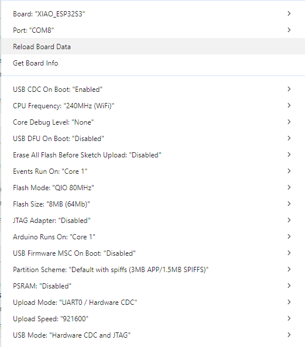

# morallyquestionable

## Materialien:
1. Seeed XIAO ESP32-S3 mit Camera-Extension/Board (da dort das I2S-Mikrofon und SD-Karten-Slot dran sind)
2. Akku (bisher genutzt: 380mAh) mit Battery-Protection-System (Overvoltage, Overcurrent, Overdischarge, Short-Circuit-Protection)
3. isolierte Kabel / Silberdraht
4. (**max.** 64 GB) SD-Karte (die von Raspberry Pi sind *sehr* preiswert)
5. passendes Gehäuse für die gewählte Akku-Größe (Files für 3D-Drucken in resources/case)

(alles kann bei reichelt.de gefunden werden)

## Assembly:
0. SD-Karte auf FAT32 formatieren (geht einfachst mit dem Raspberry-Pi-Imager):
   1. Irgendein Modell wählen
   2. Bei Betriebssystem 'Erase' wählen, dort sollte drunter stehen: 'Format card as FAT32'
   3. Zum Schluss noch SD-Karte auswählen, die formatiert werden sollte **(!Aufpassen, dass man den richtigen Datenträger auswählt!)**
   4. Damit ist nun die SD-Karte mit FAT32 formatiert - dies ist notwendig, da der ESP32S3 nur FAT32 als Dateisystem ansprechen kann
1. Pins 'D9' und 'VUSB' des ESP32S3 miteinander verbinden mittels Kabel/Draht (wird benötigt damit die Software checken kann, ob eine USB-Verbindung besteht)
2. positives und negatives Terminal des Akkus mit den kleinen 'Batterypads' 'BAT +' und '-'

## Programm hochladen:
(getestet mit Arduino IDE 2.3.6)
1. Arduino IDE öffnen
2. voice_recording.ino öffnen
3. Eventuell die ESP32 Libraries ins IDE einbinden in Einstellungen>Preferences und dann `https://raw.githubusercontent.com/espressif/arduino-esp32/gh-pages/package_esp32_index.json` hineinkopieren
4. Konfiguration:
   

## Funktionsweise

## TODO
- schaltkreis anlegen von seeed xiao esp32 mit meinen additions und akku

## Ideen:
- um nachzuweisen, dass HenryGPT ähnlich zu mir ist, wäre es interessant die Frequenz/Häufigkeit der Tokens zu vergleichen (in Form eines Spektrums), da diese gleich wie im Trainingsdatensatz sein müssten ?
- auch interessant, statistische Abhängigkeiten zu analysieren von generiertem Output gegenüber Input
- und wären statistische Abhängigkeiten und Häufigkeiten/Frequenzen gleich bei höherer Temperature
